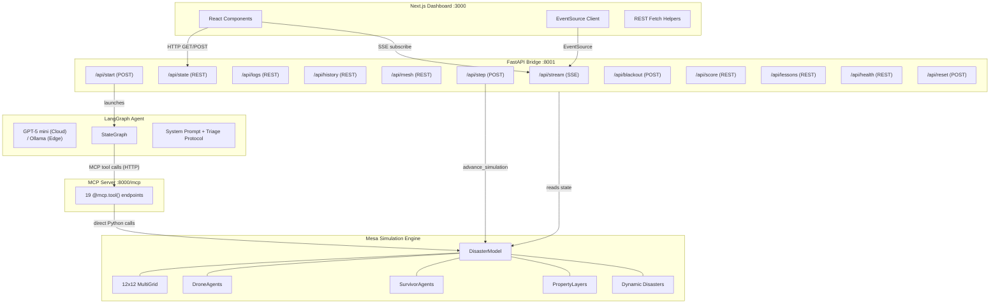
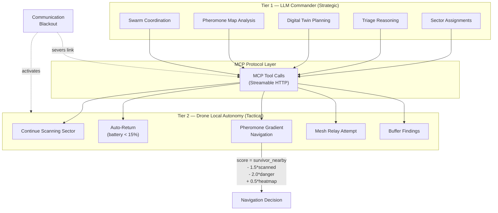
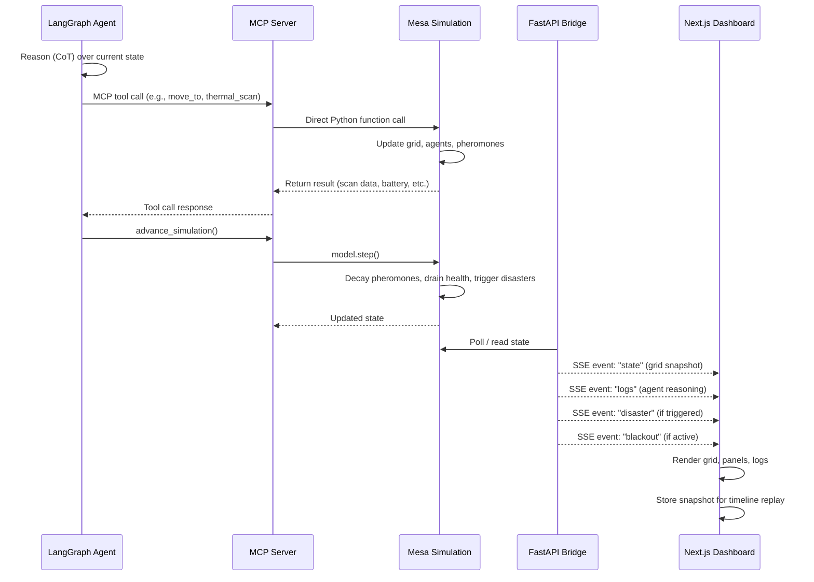
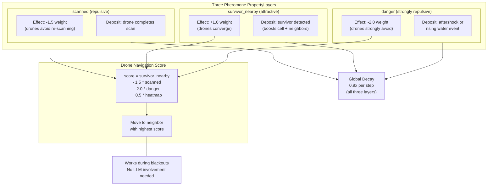
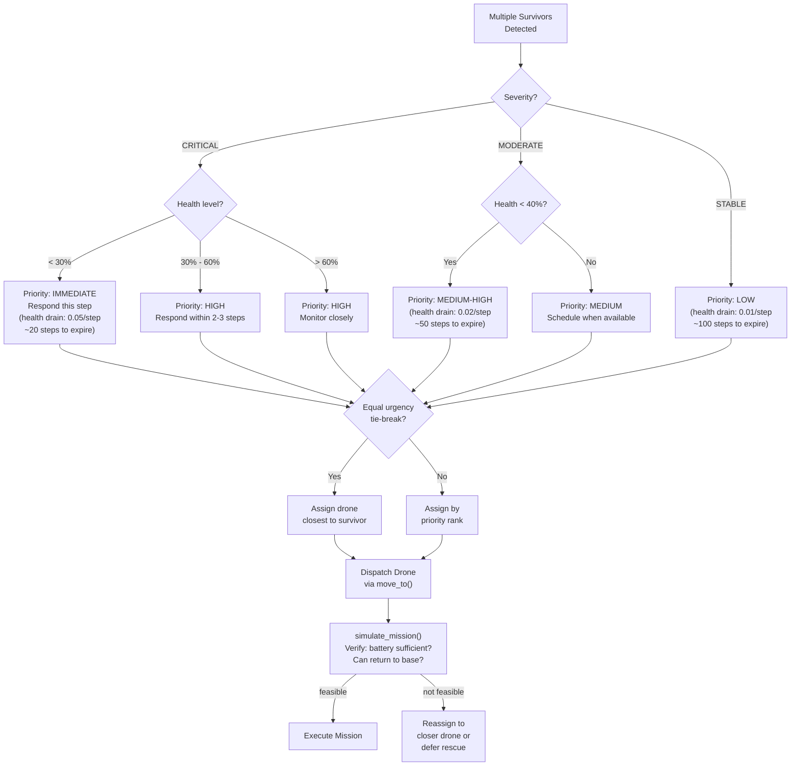
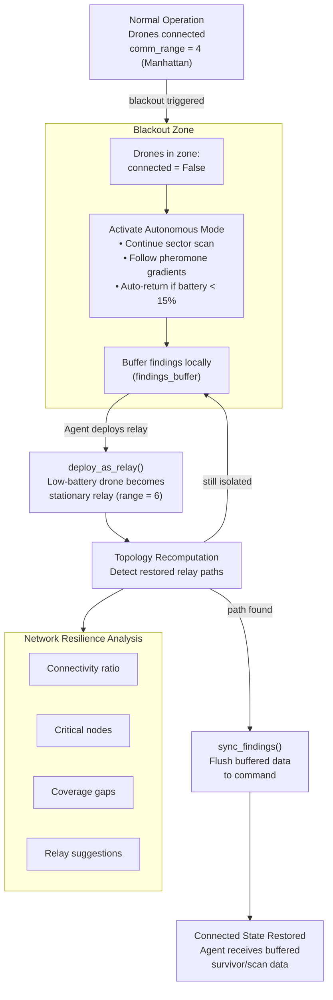
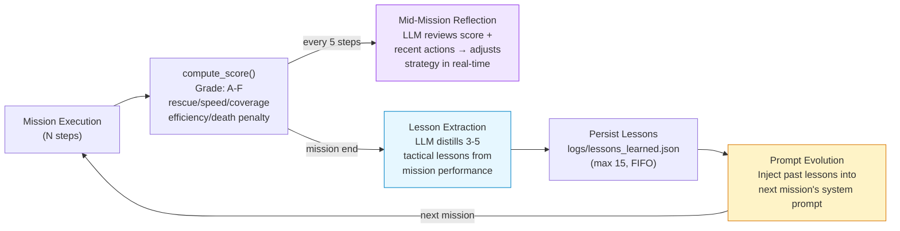
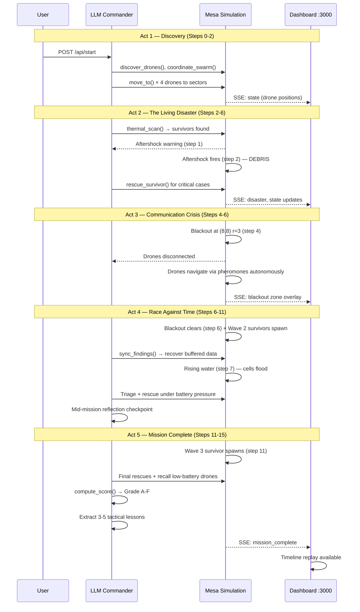

# Drone Rescuer

Drone Rescuer is a **self-healing rescue drone swarm simulation** where an autonomous AI Command Agent orchestrates a fleet of drones to find survivors in a disaster zone — adapting between cloud AI and fully offline edge inference based on connectivity. The agent **learns from every mission** (RL-inspired), reflecting mid-run and carrying tactical lessons forward so each deployment is smarter than the last. All communication between the Agent (LLM) and Drones (simulation) flows through **Model Context Protocol (MCP)**.

**Hackathon Track:** Agentic AI (Decentralised Swarm Intelligence)

**SDG Alignment:** SDG 9 (Industry, Innovation, Infrastructure) + SDG 3 (Good Health & Well-being)

---

## What It Does

An LLM Commander orchestrates 4 drones across a 12x12 disaster zone grid to locate and triage 5 survivors with deteriorating health. The simulation is alive: aftershocks reshape terrain, rising water floods cells, and communication blackouts sever the link between the AI and its drones.

What makes this system genuinely decentralised: **drones are not puppets**. The LLM sets high-level strategy, but every drone carries local autonomy rules — continuing to scan, avoid danger, and follow pheromone gradients even when communication is severed. Survivors deteriorate at different rates based on severity, forcing real-time triage decisions that showcase the LLM's chain-of-thought reasoning depth.

An RL-inspired feedback loop scores each mission (A–F), triggers mid-mission reflection checkpoints, and extracts tactical lessons that are injected into the next mission's prompt — so past mistakes become future instincts.

The entire system is observable through a real-time Next.js dashboard with grid visualization, drone telemetry, reasoning logs, mesh network topology, mission timeline replay, and voice narration of critical events.

---

## Key Innovation: Two-Tier Intelligence

| Tier | Role | How It Works |
|------|------|-------------|
| **Tier 1 — LLM Commander** (Strategic) | Sector assignments, triage reasoning, digital twin planning, pheromone map analysis, swarm coordination, mid-mission reflection, cross-mission adaptive learning | Communicates via MCP tool calls over Streamable HTTP |
| **Tier 2 — Drone Local Autonomy** (Tactical) | Continue scanning, auto-return at low battery, pheromone gradient navigation, mesh relay, buffer findings | Operates independently during blackouts — MCP tools reject commands to disconnected drones, enforcing true autonomous operation |

During a communication blackout, drones seamlessly switch to autonomous mode: following pheromone gradients (`score = survivor_nearby - 1.5*scanned - 2.0*danger + 0.5*heatmap`), auto-returning when battery drops below 15%, and buffering discoveries until connectivity is restored.

---

## Adaptive AI: Cloud ↔ Edge

Real disasters don't guarantee internet. Drone Rescuer adapts its AI backbone to whatever connectivity is available — from full cloud reasoning to fully offline edge inference.

### Dual-Mode Intelligence

| Mode | When | LLM Provider | Capability |
|------|------|-------------|------------|
| **Connected Mode** (Minor Disaster) | Internet partially available | Cloud LLM (GPT-5 mini via OpenAI) | Maximum reasoning depth, complex triage logic, full chain-of-thought planning |
| **Edge Mode** (Catastrophic Disaster) | Internet completely severed | Local LLM via Ollama (Llama 3.1, Phi-3, Mistral) | Full agent capabilities — MCP tools, triage reasoning, swarm coordination — all without a single byte leaving the device |

### Three-Layer Resilience

```
Layer 1: Cloud LLM available     → Full strategic reasoning (GPT-5 mini)
Layer 2: Cloud down, local LLM   → Edge AI takes command (Ollama)
Layer 3: All AI down              → Tier 2 drone autonomy (pheromones, auto-return, mesh relay)
```

No matter how many layers fail, drones keep operating. The system degrades gracefully — never catastrophically.

### Seamless Switchover

LangChain's provider abstraction means switching between cloud and edge is a single environment variable:

```env
LLM_PROVIDER=openai    # Cloud mode (default)
LLM_PROVIDER=ollama    # Edge mode (offline)
```

The system detects connectivity loss and falls back to the local model. Same MCP tools, same triage protocol, same swarm coordination — just a different brain.

### Mesh Network = Zero Cloud

Drone-to-drone communication is entirely peer-to-peer via mesh topology. No cloud relay, no internet dependency. The mesh works identically in both connected and edge modes.

---

## Architecture

### System Architecture



### Two-Tier Intelligence Flow



### Mission Step Lifecycle



### Pheromone System



### Triage Decision Tree



### Mesh Network & Self-Healing



### Adaptive Learning Loop



---

## Tech Stack

| Layer | Technology | Port |
|---|---|---|
| Simulation Engine | Mesa 3 (Python) | — |
| MCP Server | FastMCP (`mcp` SDK, Streamable HTTP) | `localhost:8000/mcp` |
| Agent Brain | LangChain + LangGraph + `langchain-mcp-adapters` | — |
| LLM | OpenAI GPT-5 mini (cloud) / Ollama (local edge) via LangChain | — |
| API Bridge | FastAPI (SSE streaming + REST) | `localhost:8001` |
| Frontend | Next.js 16+ (App Router) + React + TypeScript + Tailwind | `localhost:3000` |

---

## Features

- **Stigmergy / Pheromone System** — Three pheromone layers (`scanned`, `survivor_nearby`, `danger`) enable implicit swarm coordination. Drones follow pheromone gradients autonomously — no centralized control needed. All pheromones decay 0.9x per step.

- **Bayesian Heatmap** — 12x12 probability grid initialized from terrain priors (buildings=0.7, roads=0.5, open=0.3). Updated in real-time: positive scan hits boost cell + neighbors, misses halve probability (floor 0.05).

- **Digital Twin (`simulate_mission`)** — Predicts battery cost, arrival battery, return feasibility, and survivor probability *before* committing a drone. Enables chain-of-thought planning.

- **Mesh Network & Self-Healing** — Drones communicate within `comm_range=4` (Manhattan distance). Blackout zones force autonomous mode — MCP tools (`move_to`, `thermal_scan`, `rescue_survivor`, `recall_drone`, `deploy_as_relay`) reject commands to disconnected drones, ensuring the LLM cannot override local autonomy. Disconnected drones buffer findings. Self-healing via topology recomputation detects restored relay paths and triggers `sync_findings()`. Low-battery drones can be sacrificed as stationary relays (`comm_range=6`).

- **Triage Protocol** — LLM reasons through survivor priority: CRITICAL + low health = immediate, MODERATE = medium, STABLE = low. Equal urgency ties broken by proximity. Digital twin validates feasibility before dispatch.

- **Dynamic Disasters** — Aftershocks (~every 10 steps) convert terrain to DEBRIS and deposit danger pheromone. Rising water (~every 15 steps) expands WATER cells and threatens nearby survivors.

- **Timeline Replay** — Every simulation step is recorded. Scrub through the entire mission with the timeline slider to review decisions and outcomes.

- **Voice Narration** — Browser SpeechSynthesis reads critical log entries aloud. Toggle on/off from the control panel.

- **RL-Inspired Adaptive Learning** — Closed feedback loop that makes the agent measurably smarter across missions. Five stages form a continuous learning cycle:

  - **Scoring Engine** — Every mission is graded A–F on a composite score. Base points per rescue scale by severity: CRITICAL = 100, MODERATE = 70, STABLE = 50. On top of that: a health bonus (`health × 50`), a speed bonus (+20 pts if rescued in the first half of the mission), a coverage bonus (up to 200 pts based on % of grid scanned), and an efficiency bonus (remaining battery ÷ 10). Each survivor death costs −30 pts. Grade thresholds: **A** ≥ 500, **B** ≥ 350, **C** ≥ 200, **D** ≥ 100, **F** < 100.

  - **Mid-Mission Reflection** — Every 5 steps, an automatic performance checkpoint injects the current score breakdown and the prompt *"What is working? What should change?"* into the LLM context (flagged `is_critical` so it's read aloud by voice narration). This lets the agent course-correct strategy while drones are still in the field.

  - **Post-Mission Lesson Extraction** — At mission end, the LLM analyzes the full run (final score, rescue events, disaster timeline) and distills 3–5 tactical lessons. Each lesson includes a one-sentence rule, supporting evidence, and a priority tag (high / medium / low). Temperature is set to 0.3 for consistent, focused output.

  - **Persistent Memory** — Lessons are saved to `logs/lessons_learned.json` with metadata (source mission number, score, and grade). A FIFO cap of 15 lessons keeps the context window lean while retaining the most recent experience.

  - **Adaptive Prompt Evolution** — On the next mission, all stored lessons are loaded and injected as a numbered `## Adaptive Intelligence` block in the system prompt — formatted as `[PRIORITY] (Mission #N, Grade X) lesson text`. The LLM explicitly sees its own past failures and successes before making its first move.

---

## MCP Tools (19 total)

**Core (12):**

| Tool | Description |
|------|-------------|
| `discover_drones` | List active drones and their status |
| `move_to` | Move a drone to a target cell |
| `thermal_scan` | Scan cells around a drone for survivors |
| `get_battery_status` | Check a drone's battery level |
| `get_priority_map` | Get the Bayesian heatmap |
| `simulate_mission` | Digital twin prediction before committing |
| `sync_findings` | Sync buffered data from disconnected drones |
| `trigger_blackout` | Force a communication blackout zone |
| `recall_drone` | Return a drone to base |
| `get_mission_summary` | Mission statistics and progress |
| `advance_simulation` | Step the simulation forward |
| `rescue_survivor` | Rescue a found survivor at the drone's position |

**Innovation (7):**

| Tool | Description |
|------|-------------|
| `get_pheromone_map` | Read pheromone layer data |
| `get_disaster_events` | List active disaster events |
| `assess_survivor` | Get detailed survivor triage info |
| `deploy_as_relay` | Convert a drone into a stationary relay |
| `get_network_resilience` | Mesh health metrics and coverage |
| `coordinate_swarm` | Issue multi-drone coordinated orders |
| `get_performance_score` | Current mission score breakdown (grade, component scores) |

---

## Project Structure

```
drone-agents/
├── CLAUDE.md                  # Project instructions
├── prd.md                     # Product requirements document
├── architecture.md            # Mermaid architecture diagrams
├── plan.md                    # Implementation plan (6 stages)
├── requirements.txt           # Python dependencies
├── simulation/
│   ├── __init__.py
│   ├── model.py               # DisasterModel (grid, terrain, heatmap, pheromones, disasters)
│   ├── agents.py              # DroneAgent (local autonomy), SurvivorAgent (health decay)
│   ├── mesh_network.py        # Mesh topology, blackout, relay, resilience analysis
│   └── state.py               # Shared model singleton (used by MCP + bridge)
├── mcp_server/
│   ├── __init__.py
│   └── server.py              # FastMCP server — 19 @mcp.tool() definitions
├── agent/
│   ├── __init__.py
│   ├── graph.py               # LangGraph StateGraph (MessagesState)
│   ├── prompts.py             # System prompt with triage protocol
│   ├── memory.py              # Post-mission lesson extraction and adaptive prompt builder
│   └── runner.py              # Entry point: MCP client → agent loop
├── api/
│   ├── __init__.py
│   └── bridge.py              # FastAPI: SSE /api/stream, REST /api/state, /api/logs, /api/history
├── dashboard/                 # Next.js app
│   ├── app/
│   │   ├── page.tsx           # 4-panel layout + timeline slider
│   │   └── layout.tsx         # Dark theme layout
│   ├── components/
│   │   ├── GridMap.tsx         # 12x12 grid, heatmap overlay, pheromones, drone markers
│   │   ├── DronePanel.tsx     # Battery bars, status, survivor health bars
│   │   ├── MeshGraph.tsx      # SVG network topology (force-directed)
│   │   ├── ReasoningLog.tsx   # Color-coded CoT log + SpeechSynthesis voice narration
│   │   ├── ControlPanel.tsx   # Start, blackout, step, voice toggle, reset
│   │   └── TimelineSlider.tsx # Mission replay scrubber (rewind to any step)
│   └── lib/
│       └── api.ts             # SSE client (EventSource) + REST fetch helpers
├── scripts/
│   ├── run_all.sh             # Start all 4 services
│   └── demo.py                # Scripted 5-act demo sequence
└── logs/
    ├── mission_log.json       # Persisted agent reasoning + tool calls
    └── lessons_learned.json   # Persisted tactical lessons from past missions
```

---

## Getting Started

### Prerequisites

- Python 3.11+
- Node.js 18+
- An OpenAI API key (cloud mode) OR [Ollama](https://ollama.com) installed (edge mode)

### Install Dependencies

```bash
# Python (from project root)
pip install "mcp[cli]" mesa langchain-mcp-adapters langgraph langchain-openai langchain fastapi uvicorn numpy python-dotenv

# For edge/offline mode (optional)
# Install Ollama: https://ollama.com
# ollama pull llama3.1

# Frontend
cd dashboard
npm install
```

### Environment Variables

Create a `.env` file in the project root:

```env
# Cloud Mode (default)
OPENAI_API_KEY=sk-xxxxx
LLM_PROVIDER=openai

# Edge Mode (offline — no API key needed)
# LLM_PROVIDER=ollama
# OLLAMA_MODEL=llama3.1

MCP_SERVER_URL=http://localhost:8000/mcp
API_BRIDGE_URL=http://localhost:8001
DEMO_MODE=1
MSG_WINDOW_SIZE=20
LLM_MAX_TOKENS=16384
```

### Start All Services

**Option A: One command (recommended)**

```bash
bash scripts/run_all.sh
```

This starts all 4 services (MCP Server, API Bridge, Agent Runner, Dashboard) and prints their URLs. Press `Ctrl+C` to stop everything.

**Option B: Manual (2 terminals)**

```bash
# Terminal 1: Backend (starts MCP server + API bridge + agent)
python -m agent.runner
# → MCP Server on http://localhost:8000/mcp
# → API Bridge on http://localhost:8001
# → Agent connects and starts mission

# Terminal 2: Frontend
cd dashboard && npm run dev
# → http://localhost:3000
```

---

## Demo

A scripted 5-act demo drives the simulation through a compelling narrative:

| Act | Title | What Happens |
|-----|-------|-------------|
| 1 | Discovery | LLM Commander discovers drones, analyzes the zone, deploys the swarm |
| 2 | The Living Disaster | Drones scan the grid, find survivors, aftershocks reshape terrain |
| 3 | Communication Crisis | Blackout at zone (8,8) — drones lose contact and go autonomous |
| 4 | Race Against Time | Battery dropping, survivors losing health, critical triage decisions |
| 5 | Mission Complete | Final results, timeline replay, voice narration |

```bash
# Prerequisite: all services running (run_all.sh or manual)
python scripts/demo.py
```

The demo pauses between acts for live narration. Open the dashboard at `http://localhost:3000` to watch in real-time.

### How the Demo Flows

1. **Discovery (Steps 0–2):** The user hits `POST /api/start`. The LLM Commander calls `discover_drones()` and `coordinate_swarm()` to survey available drones, then dispatches them to quadrant sectors via `move_to()`. The dashboard begins streaming live positions over SSE.

2. **The Living Disaster (Steps 1–4):** Drones spread out and run `thermal_scan()` to locate survivors. At step 1, a seismic warning fires; at step 2, an aftershock strikes near (5,4), converting cells to DEBRIS and depositing danger pheromones. The agent triages and begins `rescue_survivor()` calls for critical cases.

3. **Communication Crisis (Steps 3–6):** A blackout warning arrives at step 3. At step 4, a communication blackout hits zone (8,8) with radius 3 — drones in range lose contact and switch to autonomous pheromone-guided navigation. The dashboard overlays the blackout zone. Disconnected drones buffer any findings locally.

4. **Race Against Time (Steps 6–11):** The blackout clears at step 6 and Wave 2 survivors spawn. The agent calls `sync_findings()` to recover buffered data from previously disconnected drones. At step 7, rising water floods cells near (10,7). A second aftershock warning fires at step 9, striking at step 10. The agent must balance dwindling battery against survivor health decay, making tough triage calls. A mid-mission reflection checkpoint triggers adaptive learning.

5. **Mission Complete (Steps 11–15):** Wave 3 survivors spawn at step 11. The agent executes final rescues, recalls low-battery drones to base, computes a mission score (Grade A–F), and extracts 3–5 tactical lessons for future runs. The dashboard emits `mission_complete` via SSE and the full timeline replay becomes available.

### End-to-End Demo Flow



---

## API Endpoints

| Method | Path | Purpose |
|---|---|---|
| GET | `/api/stream` | SSE stream (events: `state`, `logs`, `disaster`, `blackout`) |
| GET | `/api/state` | Full simulation state snapshot |
| GET | `/api/logs` | Agent reasoning entries |
| GET | `/api/history` | All state snapshots for mission replay |
| GET | `/api/mesh` | Mesh network topology |
| POST | `/api/start` | Begin autonomous agent mission |
| POST | `/api/step` | Manually advance simulation N steps |
| POST | `/api/blackout` | Trigger blackout event `{zone_x, zone_y, radius}` |
| GET | `/api/score` | Current mission score breakdown (grade, rescue/speed/coverage/efficiency/death penalty) |
| GET | `/api/lessons` | Accumulated tactical lessons from past missions |
| GET | `/api/health` | Health check with mission status |
| POST | `/api/reset` | Reset simulation to fresh state |

---

## Dashboard

The Next.js dashboard provides 6 React components for real-time mission observation:

| Component | What It Shows |
|-----------|--------------|
| **GridMap** | 12x12 grid with terrain coloring, Bayesian heatmap overlay, pheromone visualization, drone markers with movement trails, survivor indicators, and scan pulse animations |
| **DronePanel** | Battery level bars, drone status (active/returning/relay/autonomous), position, survivor health bars, mission score panel, and mission completion overlay |
| **MeshGraph** | Force-directed SVG graph showing drone-to-drone communication links, relay nodes, and blackout zone overlay |
| **ReasoningLog** | Color-coded scrolling log of the LLM's chain-of-thought reasoning, tool calls, and triage decisions. Pink [REFLECT] entries show mid-mission reflection checkpoints. Critical entries trigger voice narration |
| **ControlPanel** | Start mission, trigger blackout, advance steps, toggle voice narration, reset simulation |
| **TimelineSlider** | Scrub through recorded mission history step-by-step with live/replay mode toggle |

---

## How It Works

Each mission step follows this cycle:

1. **Reason** — The LangGraph agent analyzes current state (drone positions, battery, heatmap, pheromones, known survivors)
2. **Act** — The agent issues MCP tool calls: move drones, scan cells, assess survivors, coordinate the swarm
3. **Simulate** — The Mesa engine processes actions: update grid, deposit pheromones, update Bayesian heatmap
4. **Advance** — `advance_simulation()` ticks the world: decay pheromones, drain survivor health, trigger random disasters, recompute mesh topology
5. **Observe** — FastAPI bridge streams updated state to the dashboard via SSE
6. **Repeat** — Agent loops back to reasoning with new information, until all survivors are found or resources are exhausted
