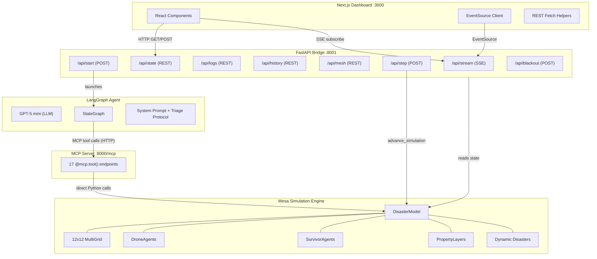
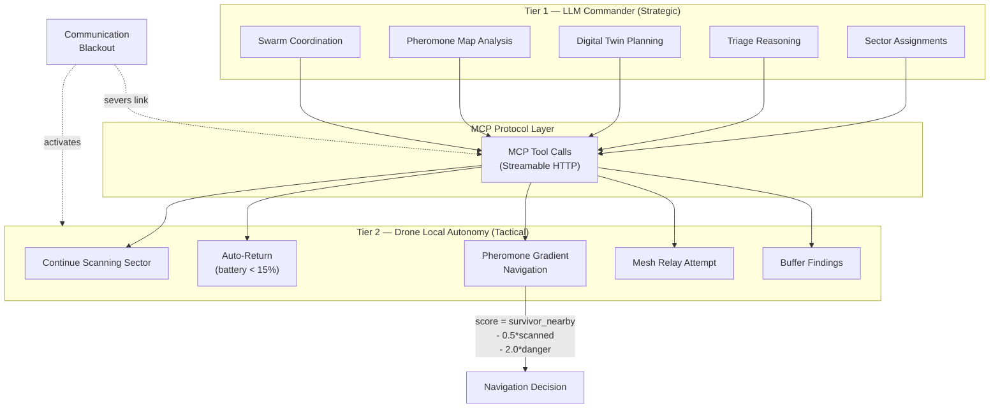
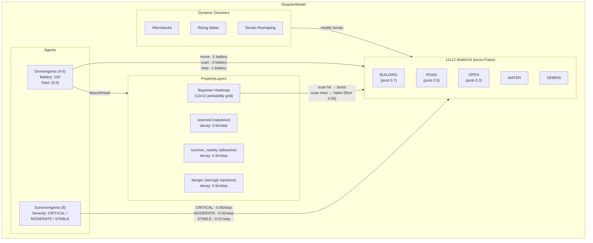
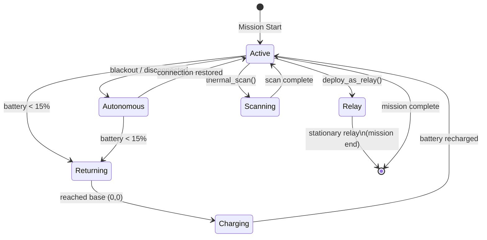
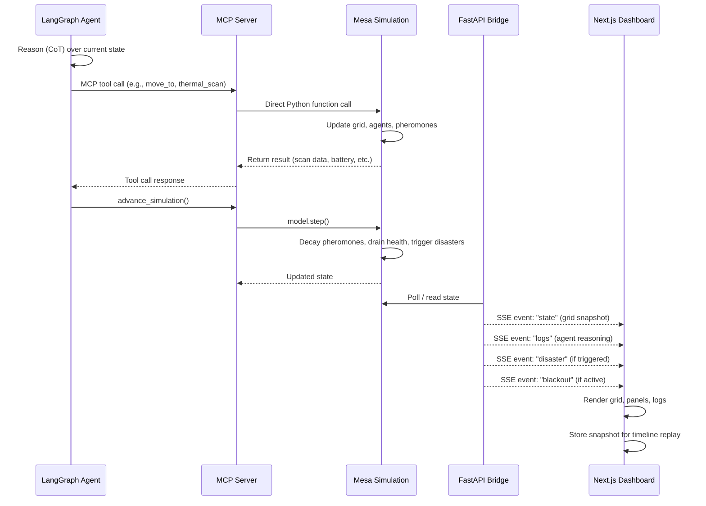
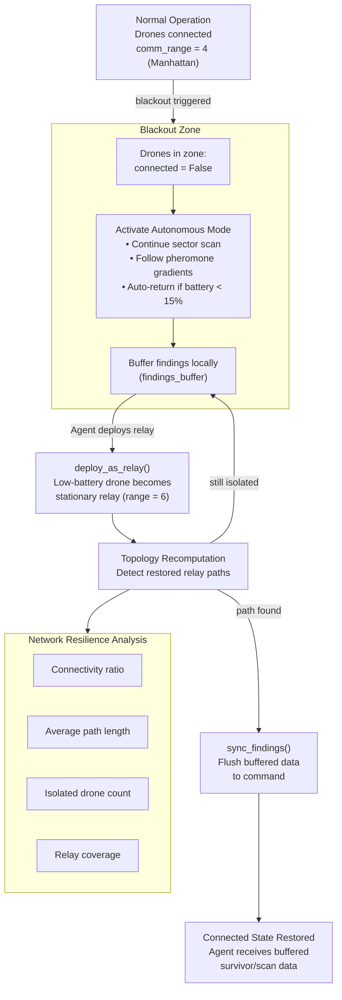
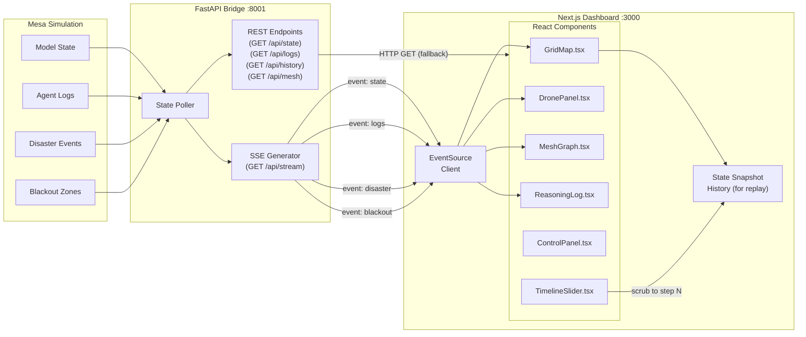
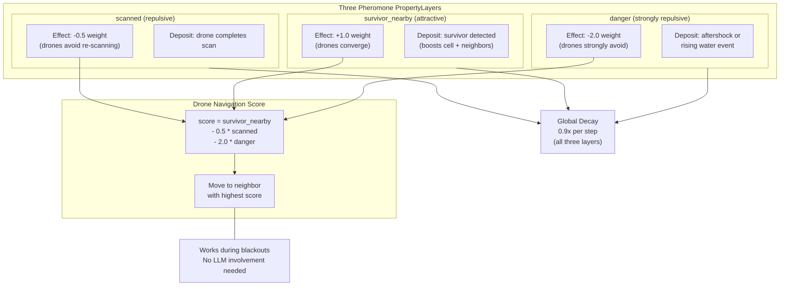
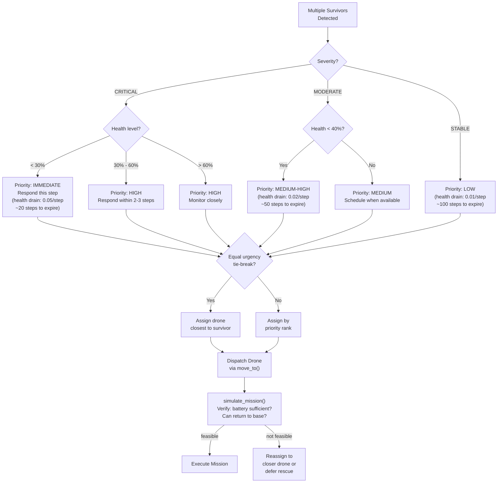

# Architecture — Drone Swarm Rescue Simulation

Visual architecture reference for the self-healing rescue drone swarm simulation. All diagrams use [Mermaid](https://mermaid.js.org/) syntax and render on GitHub, VS Code (with Mermaid extension), and most modern Markdown previewers.

---

## 1. System Architecture

High-level service topology with ports and protocols.

---

## 2. Two-Tier Intelligence Flow

Strategic LLM decisions flow down via MCP; tactical drone autonomy operates independently.

---

## 3. Mesa Simulation Internals

Components within the DisasterModel.

---

## 4. MCP Tool Categories

17 tools organized by category.

```mermaid
flowchart LR
    subgraph Core["Core Tools (11)"]
        discover_drones["discover_drones<br>List active drones"]
        move_to["move_to<br>Move drone to cell"]
        thermal_scan["thermal_scan<br>Scan cell for survivors"]
        get_battery["get_battery_status<br>Drone battery level"]
        get_priority["get_priority_map<br>Bayesian heatmap"]
        simulate["simulate_mission<br>Digital twin prediction"]
        sync["sync_findings<br>Sync buffered data"]
        trigger_blackout["trigger_blackout<br>Force comm blackout"]
        recall["recall_drone<br>Return drone to base"]
        get_summary["get_mission_summary<br>Mission statistics"]
        advance["advance_simulation<br>Step simulation forward"]
    end

    subgraph Innovation["Innovation Tools (6)"]
        pheromone["get_pheromone_map<br>Pheromone layer data"]
        disaster["get_disaster_events<br>Active disaster list"]
        assess["assess_survivor<br>Survivor triage info"]
        relay["deploy_as_relay<br>Convert drone to relay"]
        resilience["get_network_resilience<br>Mesh health metrics"]
        coordinate["coordinate_swarm<br>Multi-drone orders"]
    end

    AGENT["LangGraph Agent"] -->|"MCP HTTP"| Core
    AGENT -->|"MCP HTTP"| Innovation
    Core -->|"Python calls"| MESA["Mesa Simulation"]
    Innovation -->|"Python calls"| MESA
```

---

## 5. Drone Agent State Machine

Drone lifecycle states and transitions.

---

## 6. Mission Step Lifecycle

Sequence of events during a single simulation step.

---

## 7. Mesh Network & Self-Healing

How the mesh network responds to blackouts and recovers.

---

## 8. Data Flow: SSE Streaming

How state flows from simulation to the user's browser.

---

## 9. Pheromone System

Three pheromone layers, their triggers, decay, and effect on drone navigation.

---

## 10. Triage Decision Tree

Priority protocol when multiple survivors are found.

---

## Quick Reference

| Service | Port | Protocol |
|---|---|---|
| MCP Server | `:8000/mcp` | Streamable HTTP |
| FastAPI Bridge | `:8001` | SSE + REST |
| Next.js Dashboard | `:3000` | HTTP |
| Base Station | Grid `(0,0)` | — |

| Resource | Cost |
|---|---|
| Idle step | 1 battery |
| Move | 2 battery |
| Thermal scan | 3 battery |
| Auto-return threshold | < 15% battery |
| Relay comm range | 6 (vs normal 4) |
